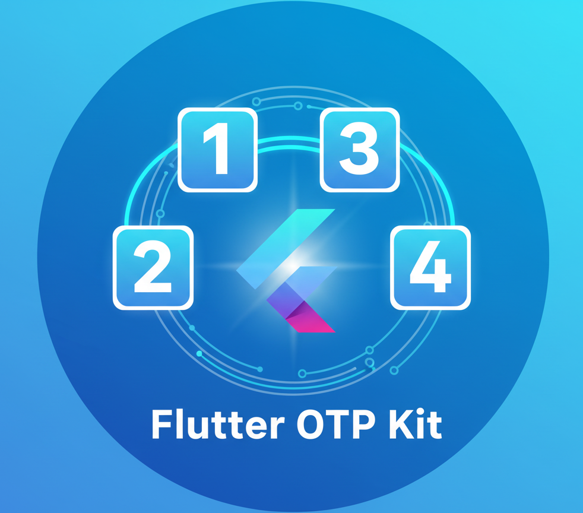

<div align="center">
  <h1 align="center" style="font-size: 56px; margin-bottom: 0;">Flutter OTP Kit</h1>
  <h3 style="margin-top: 8px; font-weight: normal;">A comprehensive and feature‑rich OTP verification package for Flutter</h3>
  
  <!-- Donations -->
  <a href="https://buymeacoffee.com/seifmoustafa" target="_blank" rel="noopener noreferrer">
   
  </a>
  <div align="center">
   <a href="https://buymeacoffee.com/seifmoustafa">
    
  </a>
   <a href="https://buymeacoffee.com/seifmoustafa">
    
  </a>
 </div>
  <div align="center" style="margin-top: 8px;">
    <a href="https://github.com/seifmoustafa" target="_blank" rel="noopener noreferrer" style="margin-right:8px;">
      
    </a>
    <a href="https://www.linkedin.com/in/seif-moustafa-60115f/" target="_blank" rel="noopener noreferrer">
      
    </a>
  </div>
</div>

---

<!-- Package Info -->

<p align="center">
  
</p>
<p align="center">
  <a href="https://pub.dev/packages/flutter_otp_kit" target="_blank" rel="noopener noreferrer">
    
  </a>
  
  
</p>
## 📋 Table of Contents
1. [Overview](#overview)
2. [Why Choose Flutter OTP Kit](#why-choose-flutter-otp-kit)
3. [Features](#features)
4. [Installation](#installation)
5. [Quick Start](#quick-start)
6. [Advanced Configuration](#advanced-configuration)
7. [Services](#services)
8. [Platform Support](#platform-support)
9. [Examples](#examples)
10. [Migration Guide](#migration-guide)
11. [Troubleshooting](#troubleshooting)
12. [API Reference](#api-reference)

## 🎯 Overview

**Flutter OTP Kit v3.0.0** is a comprehensive OTP (One-Time Password) verification package for Flutter. This version introduces a completely rewritten architecture with modern patterns and extensive customization options.

### 🚀 **KEY FEATURES**

- ✅ **Complete OTP Solution** - Timer, validation, masking, everything in one package
- ✅ **SMS Autofill Integration** - SMS Retriever API, User Consent API, iOS native SMS
- ✅ **Advanced Animations** - 10+ error animation types, 7+ fill animations, cursor animations
- ✅ **Performance Monitoring** - Real-time performance tracking and optimization
- ✅ **Biometric Integration** - Face ID, Touch ID, Fingerprint support across platforms
- ✅ **Platform Optimization** - iOS, Android, Web, Desktop specific features
- ✅ **Enterprise Ready** - Rate limiting, security monitoring, audit logging
- ✅ **Zero Breaking Changes** - Existing code continues to work perfectly

## 🎯 Why Choose Flutter OTP Kit?

### 🌟 **Comprehensive Solution**

- **Complete OTP Flow**: Timer, validation, masking, everything in one package
- **Modern Architecture**: Clean separation of concerns, advanced state management
- **Extensive Customization**: Unlimited styling and behavior options
- **Cross-Platform**: Optimized for iOS, Android, Web, and Desktop

### 🚀 **Advanced Features**

- **SMS Autofill**: SMS Retriever API, User Consent API, iOS native SMS
- **Biometric Integration**: Face ID, Touch ID, Fingerprint support
- **Performance Monitoring**: Real-time metrics and optimization
- **Enterprise Ready**: Rate limiting, security monitoring, audit logging

### 🔄 **Migration Benefits**

- **Zero Breaking Changes**: Existing code continues to work
- **Gradual Adoption**: Add features incrementally
- **Modern Patterns**: Built with latest Flutter best practices

## 🌟 Features

### 🎨 Visual Customization

- **7+ Field Shapes**: Circle, Stadium, Underlined, Custom, Rounded Rectangle
- **Advanced Styling**: Gradients, Shadows, Custom Decorations
- **Responsive Design**: Adaptive layouts for all screen sizes
- **Theme Support**: Light/Dark mode, custom themes

### 🎬 Animation & Cursor System (New in 3.0.0)

- **Main Widget Animations**: Fade, Scale, Slide entrance
- **Field Fill Animations**: Scale, Rotate, Slide (4 directions)
- **Error Animations**: Shake, Scale, Rotate, Bounce, Pulse, Wiggle, Slide
- **Cursor Styles (New)**: `system`, `none`, `bar`, `block`, `underline`, `outline`, `doubleBar`, `dashedUnderline`, `beamCap`, `beamNotch`, `wedge`, `ring`, `strikethrough`, `doubleUnderline`, `gradientBar`, `glowBar`
- **Placement & Centering**: Underline variants are bottom-centered and tuned for consistent height; ring has dynamic min size for visibility
- **Cursor Animations**: Blink, Scale, custom timing; exactly one cursor renders at a time
- **Smooth Transitions**: Configurable curves and durations
- **New in 3.0.0**: Main-level animation overrides from `OtpKit` that take precedence over `OtpFieldConfig`
- **New in 3.0.0**: "One style per case" — exactly one fill animation and one error animation apply at a time

### 📱 Platform Features

- **iOS**: Face ID, Touch ID, native SMS autofill
- **Android**: Fingerprint, SMS Retriever API, User Consent API
- **Web**: Optimized keyboard handling, accessibility
- **Desktop**: Platform-specific optimizations

### 🔒 Security & Performance

- **Rate Limiting**: Configurable attempt limits
- **Biometric Integration**: Secure authentication
- **Performance Monitoring**: Real-time metrics
- **Memory Optimization**: Lazy loading, cleanup
- **Audit Logging**: Security event tracking

## 📦 Installation

Add to your `pubspec.yaml`:

```yaml
dependencies:
  flutter_otp_kit: ^3.0.0
```

### 🔄 Migration from Previous Versions

**From v2.x.x to v3.0.0:**

```dart
// Old way (still works)
OtpVerificationWidget(
  onVerify: (otp) => backend.verify(otp),
  onResend: () => backend.resend(),
)

// New way (recommended)
OtpKit(
  onVerify: (otp) async => await backend.verify(otp),
  onResend: () => backend.resend(),
)
```

**From Pinput:**

```dart
// Old Pinput code
Pinput(
  onCompleted: (pin) => print(pin),
)

// New Flutter OTP Kit code
OtpKit(
  fieldCount: 4,
  onVerify: (otp) async {
    print(otp);
    return true;
  },
  onResend: () {},
)
```

**From Smart Auth:**

```dart
// Old Smart Auth code
SmartAuth.getSmsCode()

// New Flutter OTP Kit code
final code = await OtpSmsService.instance.getSmsCode();
```

## 🚀 Quick Start

### Basic Usage

```dart
import 'package:flutter_otp_kit/flutter_otp_kit.dart';

class OtpScreen extends StatelessWidget {
  @override
  Widget build(BuildContext context) {
    return Scaffold(
      body: OtpKit(
  title: 'Verify Phone Number',
        subtitle: 'Enter the code sent to +1 (555) 123-4567',
        fieldCount: 4,
        onVerify: (otp) async {
          // Verify OTP with your backend
          return otp == '1234';
  },
  onResend: () {
          // Resend OTP
        },
      ),
    );
  }
}
```

### Advanced Usage

```dart
OtpKit(
  title: 'Advanced OTP Verification',
  subtitle: 'Enter the code sent to {contactInfo}',
  fieldCount: 6,

  // Visual customization
  fieldConfig: OtpFieldConfig.preset(OtpFieldPreset.rounded),
  primaryColor: Colors.blue,
  successColor: Colors.green,

  // Animation configuration
  animationConfig: OtpAnimationConfig(
    enableAnimation: true,
    fieldFillAnimationType: FieldFillAnimationType.scale,
    errorFieldAnimationType: ErrorFieldAnimationType.bounce,
    enableCursorAnimation: true,
    cursorBlinkDuration: Duration(milliseconds: 1000),
  ),

  // Main-level animation overrides (override field-level config)
  enableFieldStateAnimationOverride: true,
  fieldFillAnimationTypeOverride: FieldFillAnimationType.rotate,
  fieldFillRotationRadiansOverride: 0.15,
  errorFieldAnimationTypeOverride: ErrorFieldAnimationType.bounce,
  errorShakeAmplitudeOverride: 6.0,
  cursorEnableAnimationOverride: true,
  cursorBlinkDurationOverride: Duration(milliseconds: 700),

  // SMS autofill
  smsConfig: OtpSmsConfig(
    enableSmsAutofill: true,
    enableSmartAuth: true,
    appSignature: 'your-app-signature',
  ),

  // Performance monitoring
  performanceConfig: OtpPerformanceConfig(
    enablePerformanceMonitoring: true,
    enableMemoryOptimization: true,
  ),

  // Security features
  securityConfig: OtpSecurityConfig(
    enableRateLimiting: true,
    maxAttemptsPerMinute: 5,
    enableBiometricIntegration: true,
  ),

  onVerify: (otp) async {
    // Your verification logic
    return await verifyOtpWithBackend(otp);
  },
  onResend: () {
    // Your resend logic
  },
)
```

## ⚙️ Advanced Configuration

### Animation Configuration

```dart
OtpAnimationConfig(
  // Main animations
  enableAnimation: true,
  animationDuration: Duration(milliseconds: 300),
  animationCurve: Curves.easeInOut,

  // Field animations
  enableFieldStateAnimation: true,
  fieldTransitionDuration: Duration(milliseconds: 150),

  // Fill animations
  fieldFillAnimationType: FieldFillAnimationType.scale,
  fieldFillSlideOffset: Offset(6, 0),
  fieldFillRotationRadians: 0.10,

  // Error animations
  errorFieldAnimationType: ErrorFieldAnimationType.shake,
  errorShakeAmplitude: 4.0,
  errorShakeFrequency: 10.0,

  // Cursor animations
  enableCursorAnimation: true,
  cursorBlinkDuration: Duration(milliseconds: 1000),
  cursorColor: Color(0xFF2196F3),
  cursorWidth: 2.0,

  // State transitions
  stateTransitionDuration: Duration(milliseconds: 200),
  stateTransitionCurve: Curves.easeInOut,

  // Decoration animations
  enableDecorationAnimation: true,
  decorationAnimationDuration: Duration(milliseconds: 250),
)

// OtpKit-level overrides (optional)
OtpKit(
  // ...
  fieldFillAnimationTypeOverride: FieldFillAnimationType.slideRight,
  errorFieldAnimationTypeOverride: ErrorFieldAnimationType.wiggle,
)
```

### SMS Configuration

```dart
OtpSmsConfig(
  // Basic SMS autofill
  enableSmsAutofill: true,

  // Smart Auth integration
  enableSmartAuth: true,
  appSignature: 'your-app-signature',

  // SMS Retriever API
  enableSmsRetrieverAPI: true,
  smsRetrieverTimeout: Duration(seconds: 60),

  // SMS User Consent API
  enableSmsUserConsentAPI: true,
  smsUserConsentTimeout: Duration(seconds: 30),

  // SMS validation
  enableSmsValidation: true,
  smsValidationRegex: r'\b\d{4,8}\b',

  // Error handling
  enableSmsErrorHandling: true,
  enableSmsLogging: false,
)
```

### Performance Configuration

```dart
OtpPerformanceConfig(
  // Lazy loading
  enableLazyLoading: true,
  maxVisibleFields: 8,

  // Memory optimization
  enableMemoryOptimization: true,
  animationCleanupDelay: Duration(seconds: 5),

  // Animation pooling
  enableAnimationPooling: true,
  maxAnimationPoolSize: 10,

  // Field recycling
  enableFieldRecycling: true,

  // Background cleanup
  enableBackgroundCleanup: true,
  cleanupInterval: Duration(minutes: 1),

  // Monitoring
  enablePerformanceMonitoring: true,
  enableMemoryLeakDetection: false,

  // Optimization
  enableAnimationOptimization: true,
  enableWidgetOptimization: true,
)
```

### Security Configuration

```dart
OtpSecurityConfig(
  // Rate limiting
  enableRateLimiting: true,
  maxAttemptsPerMinute: 5,
  maxAttemptsPerHour: 20,
  lockoutDuration: Duration(minutes: 15),

  // Biometric integration
  enableBiometricIntegration: true,
  biometricTimeout: Duration(seconds: 30),

  // Advanced validation
  enableAdvancedValidation: true,
  validationChecksum: false,
  validationPattern: r'^\d{4,8}$',

  // Encryption
  enableEncryption: false,
  encryptionKey: 'your-encryption-key',

  // Audit logging
  enableAuditLogging: true,
  enableSecurityMonitoring: true,

  // Anti-tampering
  enableAntiTampering: false,

  // Session management
  enableSessionManagement: false,
  sessionTimeout: Duration(minutes: 10),
)
```

## 🔧 Services

### SMS Service

```dart
// Initialize SMS service
await OtpSmsService.instance.initialize(smsConfig);

// Listen for SMS codes
OtpSmsService.instance.smsCodeStream.listen((code) {
  // Handle received SMS code
});

// Get SMS code with timeout
final code = await OtpSmsService.instance.getSmsCode(
  timeout: Duration(seconds: 30),
);

// Check availability
final isAvailable = await OtpSmsService.instance.isSmsAutofillAvailable();
```

### Performance Monitor

```dart
// Initialize performance monitoring
OtpPerformanceMonitor.instance.initialize(performanceConfig);

// Listen for performance metrics
OtpPerformanceMonitor.instance.metricsStream.listen((metrics) {
  print('Memory: ${metrics['memoryUsage']}');
  print('FPS: ${metrics['animationFPS']}');
});

// Get performance summary
final summary = OtpPerformanceMonitor.instance.getPerformanceSummary();

// Optimize performance
OtpPerformanceMonitor.instance.optimizePerformance();
```

### Biometric Service

```dart
// Initialize biometric service
await OtpBiometricService.instance.initialize();

// Check availability
final isAvailable = await OtpBiometricService.instance.isBiometricAvailable();
final types = await OtpBiometricService.instance.getAvailableBiometricTypes();

// Authenticate
final success = await OtpBiometricService.instance.authenticate(
  reason: 'Verify OTP with biometric authentication',
);

// Listen for events
OtpBiometricService.instance.eventStream.listen((event) {
  if (event is BiometricSuccessEvent) {
    // Authentication successful
  } else if (event is BiometricErrorEvent) {
    // Authentication failed
  }
});
```

### Platform Service

```dart
// Initialize platform service
await OtpPlatformService.instance.initialize();

// Get platform-specific features
final keyboardType = OtpPlatformService.instance.getPlatformKeyboardType();
final formatters = OtpPlatformService.instance.getPlatformInputFormatters();
final dimensions = OtpPlatformService.instance.getPlatformFieldDimensions();

// Platform-specific haptic feedback
OtpPlatformService.instance.triggerPlatformHapticFeedback();
OtpPlatformService.instance.triggerPlatformErrorHapticFeedback();
OtpPlatformService.instance.triggerPlatformSuccessHapticFeedback();

// Check platform-specific features
final hasFaceId = await OtpPlatformService.instance.isFaceIdAvailable();
final hasFingerprint = await OtpPlatformService.instance.isFingerprintAvailable();
```

## 📱 Platform Support

### iOS Features

- ✅ Face ID integration
- ✅ Touch ID integration
- ✅ Native SMS autofill
- ✅ iOS-specific animations
- ✅ VoiceOver support

### Android Features

- ✅ Fingerprint authentication
- ✅ Face recognition
- ✅ SMS Retriever API
- ✅ SMS User Consent API
- ✅ TalkBack support

### Web Features

- ✅ Optimized keyboard handling
- ✅ Screen reader support
- ✅ Responsive design
- ✅ Performance optimizations

### Desktop Features

- ✅ Platform-specific layouts
- ✅ Keyboard navigation
- ✅ Accessibility features
- ✅ Performance optimizations

## 📚 Examples

### Example 1: Basic OTP Verification

```dart
OtpKit(
  title: 'Verify Phone Number',
  subtitle: 'Enter the code sent to +1 (555) 123-4567',
  fieldCount: 4,
  onVerify: (otp) async {
    return otp == '1234';
  },
  onResend: () {
    // Resend logic
  },
)
```

### Example 2: Modern Design with Animations

```dart
OtpKit(
  title: 'Modern Verification',
  subtitle: 'Enter the code sent to {contactInfo}',
  fieldCount: 6,
  fieldConfig: OtpFieldConfig.preset(OtpFieldPreset.rounded),
  primaryColor: Colors.blue,
  animationConfig: OtpAnimationConfig(
    fieldFillAnimationType: FieldFillAnimationType.scale,
    errorFieldAnimationType: ErrorFieldAnimationType.bounce,
  ),
  onVerify: (otp) async => true,
  onResend: () {},
)
```

### Example 3: Enterprise Security

### Example 4: Cursor Styles

```dart
// Global override
OtpKit(
  title: 'Cursor Styles',
  cursorStyle: CursorStyle.outline, // overrides per-field style
  animationConfig: const OtpAnimationConfig(enableCursorAnimation: true),
  onVerify: (otp) async => true,
  onResend: () {},
)

// Per-field styles
OtpKit(
  title: 'Dashed Underline',
  fieldConfig: const OtpFieldConfig(cursorStyle: CursorStyle.dashedUnderline),
  animationConfig: const OtpAnimationConfig(enableCursorAnimation: true),
  onVerify: (otp) async => true,
  onResend: () {},
)

OtpKit(
  title: 'No Cursor',
  fieldConfig: const OtpFieldConfig(cursorStyle: CursorStyle.none),
  animationConfig: const OtpAnimationConfig(enableCursorAnimation: false),
  onVerify: (otp) async => true,
  onResend: () {},
)
```

```dart
OtpKit(
  title: 'Secure Verification',
  subtitle: 'Enter the code sent to {contactInfo}',
  fieldCount: 6,
  securityConfig: OtpSecurityConfig(
    enableRateLimiting: true,
    maxAttemptsPerMinute: 3,
    enableBiometricIntegration: true,
    enableAuditLogging: true,
  ),
  smsConfig: OtpSmsConfig(
    enableSmartAuth: true,
    appSignature: 'your-signature',
  ),
  onVerify: (otp) async => true,
  onResend: () {},
)
```

## 🔄 Migration Guide

### From Previous Versions

```dart
// Old OtpVerificationWidget code
OtpVerificationWidget(
  onVerify: (otp) => print(otp),
  onResend: () {},
)

// New OtpKit code
OtpKit(
  onVerify: (otp) async {
    print(otp);
    return true;
  },
  onResend: () {},
)
```

### From Other OTP Packages

```dart
// Basic OTP input
OtpKit(
  fieldCount: 4,
  onVerify: (otp) async {
    // Your verification logic
    return otp == '1234';
  },
  onResend: () {
    // Your resend logic
  },
)
```

## 🐛 Troubleshooting

### Common Issues

1. **SMS Autofill Not Working**

   - Ensure app signature is correct
   - Check platform permissions
   - Verify SMS format

2. **Animations Not Smooth**

   - Enable performance monitoring
   - Check device performance
   - Reduce animation complexity

3. **Biometric Integration Issues**
   - Check platform permissions
   - Verify biometric availability
   - Test on physical device

### Performance Tips

1. **Memory Optimization**

   - Enable lazy loading for large field counts
   - Use animation pooling
   - Enable background cleanup

2. **Animation Performance**

   - Use appropriate animation curves
   - Limit concurrent animations
   - Monitor FPS metrics

3. **Platform Optimization**
   - Use platform-specific configurations
   - Enable platform-specific features
   - Test on target platforms

## 📄 License

MIT License - see LICENSE file for details.

## 🤝 Contributing

Contributions are welcome! Please read our contributing guidelines.

## 📞 Support

- 📖 Documentation: [GitHub README](https://pub.dev/packages/flutter_otp_kit)
- 🐛 Issues: [GitHub Issues](https://github.com/seifmoustafa/flutter_otp_kit/issues)
- 🧑‍💻 GitHub: [seifmoustafa](https://github.com/seifmoustafa)
- 🔗 LinkedIn: [Seif Moustafa](https://www.linkedin.com/in/seif-moustafa-60115f/)
- ☕ Buy me a coffee: [buymeacoffee.com/seifmoustafa](https://buymeacoffee.com/seifmoustafa)

---

## API Reference

### OtpKit parameters

| Name                                                                                                                                                                                                                                                                                     | Type                          | Required | Default                      | Description                                                       |
| ---------------------------------------------------------------------------------------------------------------------------------------------------------------------------------------------------------------------------------------------------------------------------------------- | ----------------------------- | -------- | ---------------------------- | ----------------------------------------------------------------- |
| onVerify                                                                                                                                                                                                                                                                                 | Future<bool> Function(String) | Yes      | -                            | Verify OTP callback. Return true for success.                     |
| onResend                                                                                                                                                                                                                                                                                 | VoidCallback                  | Yes      | -                            | Trigger resend action.                                            |
| title                                                                                                                                                                                                                                                                                    | String?                       | No       | null                         | Title text.                                                       |
| subtitle                                                                                                                                                                                                                                                                                 | String?                       | No       | null                         | Subtitle text; supports `{contactInfo}` placeholder.              |
| buttonText                                                                                                                                                                                                                                                                               | String                        | No       | 'Verify'                     | Verify button label.                                              |
| resendText                                                                                                                                                                                                                                                                               | String                        | No       | 'Resend Code'                | Resend button label.                                              |
| timerPrefix                                                                                                                                                                                                                                                                              | String                        | No       | 'Resend in'                  | Text before timer.                                                |
| contactInfo                                                                                                                                                                                                                                                                              | String?                       | No       | null                         | Contact info to show and mask.                                    |
| maskingType                                                                                                                                                                                                                                                                              | MaskingType                   | No       | MaskingType.none             | Masking strategy for contact info.                                |
| fieldCount                                                                                                                                                                                                                                                                               | int                           | No       | 4                            | Number of OTP fields.                                             |
| fieldSpacing                                                                                                                                                                                                                                                                             | double                        | No       | 12.0                         | Spacing between fields.                                           |
| fieldConfig                                                                                                                                                                                                                                                                              | OtpFieldConfig?               | No       | null                         | Per-field styling and behavior.                                   |
| cursorStyle                                                                                                                                                                                                                                                                              | CursorStyle?                  | No       | null                         | Global caret style override; wins over `fieldConfig.cursorStyle`. |
| inputType                                                                                                                                                                                                                                                                                | OtpInputType                  | No       | OtpInputType.numeric         | Input keyboard/input rules.                                       |
| enablePaste                                                                                                                                                                                                                                                                              | bool                          | No       | true                         | Allow pasting OTP.                                                |
| autoFocus                                                                                                                                                                                                                                                                                | bool                          | No       | true                         | Auto-focus first field.                                           |
| enableAutoValidation                                                                                                                                                                                                                                                                     | bool                          | No       | false                        | Validate on verify and optionally during typing.                  |
| obscureText                                                                                                                                                                                                                                                                              | bool                          | No       | false                        | Hide input.                                                       |
| obscuringCharacter                                                                                                                                                                                                                                                                       | String                        | No       | '•'                          | Character used when obscuring.                                    |
| enableInteractiveSelection                                                                                                                                                                                                                                                               | bool                          | No       | true                         | Allow text selection.                                             |
| textCapitalization                                                                                                                                                                                                                                                                       | TextCapitalization            | No       | none                         | Capitalization policy.                                            |
| unfocusOnTapOutside                                                                                                                                                                                                                                                                      | bool                          | No       | true                         | Unfocus fields when tapping outside.                              |
| customKeyboardType                                                                                                                                                                                                                                                                       | TextInputType?                | No       | null                         | Custom keyboard type.                                             |
| inputFormatters                                                                                                                                                                                                                                                                          | List<TextInputFormatter>?     | No       | null                         | Custom input formatters.                                          |
| validationRegex                                                                                                                                                                                                                                                                          | RegExp?                       | No       | null                         | Regex validation instead of customValidator.                      |
| customValidator                                                                                                                                                                                                                                                                          | String? Function(String)?     | No       | null                         | Custom validator, return error text or null.                      |
| showTimer                                                                                                                                                                                                                                                                                | bool                          | No       | true                         | Show resend timer.                                                |
| timerDuration                                                                                                                                                                                                                                                                            | int                           | No       | 60                           | Resend timer seconds.                                             |
| primaryColor                                                                                                                                                                                                                                                                             | Color                         | No       | 0xFF2196F3                   | Primary accent color.                                             |
| secondaryColor                                                                                                                                                                                                                                                                           | Color                         | No       | 0xFF757575                   | Secondary color.                                                  |
| backgroundColor                                                                                                                                                                                                                                                                          | Color                         | No       | Colors.white                 | Background color.                                                 |
| errorColor                                                                                                                                                                                                                                                                               | Color                         | No       | 0xFFE53E3E                   | Error color.                                                      |
| successColor                                                                                                                                                                                                                                                                             | Color                         | No       | 0xFF38A169                   | Success color.                                                    |
| titleStyle/subtitleStyle/buttonStyle/resendStyle/timerStyle/errorStyle                                                                                                                                                                                                                   | TextStyle?                    | No       | null                         | Typography overrides.                                             |
| animationConfig                                                                                                                                                                                                                                                                          | OtpAnimationConfig            | No       | const OtpAnimationConfig()   | Animation configuration.                                          |
| enableFieldStateAnimationOverride, fieldFillAnimationTypeOverride, fieldFillSlideOffsetOverride, fieldFillRotationRadiansOverride, errorFieldAnimationTypeOverride, errorShakeAmplitudeOverride, errorShakeFrequencyOverride, cursorEnableAnimationOverride, cursorBlinkDurationOverride | various                       | No       | null                         | Main-level overrides for animations and cursor animation.         |
| errorConfig                                                                                                                                                                                                                                                                              | OtpErrorConfig                | No       | const OtpErrorConfig()       | Error handling configuration.                                     |
| smsConfig                                                                                                                                                                                                                                                                                | OtpSmsConfig                  | No       | const OtpSmsConfig()         | SMS autofill configuration.                                       |
| performanceConfig                                                                                                                                                                                                                                                                        | OtpPerformanceConfig          | No       | const OtpPerformanceConfig() | Performance settings.                                             |
| securityConfig                                                                                                                                                                                                                                                                           | OtpSecurityConfig             | No       | const OtpSecurityConfig()    | Security and biometrics.                                          |
| spacing                                                                                                                                                                                                                                                                                  | double                        | No       | 24.0                         | Vertical spacing between sections.                                |
| padding                                                                                                                                                                                                                                                                                  | EdgeInsets                    | No       | EdgeInsets.all(16)           | Outer padding.                                                    |
| textDirection                                                                                                                                                                                                                                                                            | TextDirection?                | No       | null                         | Force RTL/LTR.                                                    |
| onChanged/onCompleted/onTimerChanged/onErrorStateChanged/onValidationStateChanged/onCompletionStateChanged                                                                                                                                                                               | callbacks                     | No       | null                         | State callbacks.                                                  |
| titleWidget/subtitleWidget/buttonWidget/resendWidget/timerWidget/errorWidget                                                                                                                                                                                                             | Widget?                       | No       | null                         | Custom widget slots.                                              |
| semanticLabel/Hint/Value                                                                                                                                                                                                                                                                 | String?                       | No       | null                         | Accessibility labels.                                             |
| enableScreenReaderSupport                                                                                                                                                                                                                                                                | bool                          | No       | true                         | Adds semantics and labels.                                        |

### OtpFieldConfig parameters

| Name                                                                                                            | Type                    | Required | Default          | Description                      |
| --------------------------------------------------------------------------------------------------------------- | ----------------------- | -------- | ---------------- | -------------------------------- |
| fieldWidth                                                                                                      | double                  | No       | 55.125           | Field width.                     |
| fieldHeight                                                                                                     | double                  | No       | 60.731           | Field height.                    |
| borderRadius                                                                                                    | double                  | No       | 17.752           | Corner radius.                   |
| borderWidth                                                                                                     | double                  | No       | 1.869            | Border width.                    |
| minResponsiveWidth                                                                                              | double                  | No       | 40.0             | Min responsive width.            |
| maxFieldHeight                                                                                                  | double                  | No       | 80.0             | Max field height.                |
| aspectRatio                                                                                                     | double?                 | No       | null             | Optional width:height ratio.     |
| primaryColor/secondaryColor/backgroundColor                                                                     | Color                   | No       | see code         | Colors.                          |
| placeholderColor                                                                                                | Color?                  | No       | null             | Placeholder color.               |
| fieldStyle                                                                                                      | TextStyle?              | No       | null             | Text style.                      |
| fieldFontSize                                                                                                   | double                  | No       | 24.0             | Font size.                       |
| fieldFontWeight                                                                                                 | FontWeight              | No       | bold             | Font weight.                     |
| letterSpacing                                                                                                   | double                  | No       | 0.5              | Letter spacing.                  |
| lineHeight                                                                                                      | double                  | No       | 1.0              | Text height.                     |
| cursorColor                                                                                                     | Color?                  | No       | null             | Caret color (custom styles).     |
| cursorHeight                                                                                                    | double?                 | No       | null             | Caret height override.           |
| cursorWidth                                                                                                     | double                  | No       | 1.0              | Caret width for bar-like styles. |
| cursorStyle                                                                                                     | CursorStyle             | No       | system           | Caret visual style.              |
| enableBlink/blinkDuration                                                                                       | bool/Duration           | No       | true/500ms       | Legacy blink hints.              |
| enableShadow/shadowColor/shadowBlurRadius/shadowSpreadRadius/shadowOffset                                       | various                 | No       | defaults         | Outer shadow.                    |
| enableInnerShadow/innerShadowColor/innerShadowBlurRadius/innerShadowSpreadRadius/innerShadowOffset              | various                 | No       | defaults         | Inner shadow.                    |
| fieldShape                                                                                                      | OtpFieldShape           | No       | roundedRectangle | Field shape.                     |
| fieldShapeConfig                                                                                                | OtpFieldShapeConfig?    | No       | null             | Custom shape builder.            |
| enableGradient/gradientConfig                                                                                   | bool/OtpGradientConfig? | No       | false/null       | Background gradient.             |
| enableCustomDecoration/customDecoration                                                                         | bool/BoxDecoration?     | No       | false/null       | Use custom decoration.           |
| focusEffect/focusScaleFactor/focusHighlightColor/focusGlowRadius/focusGlowIntensity                             | various                 | No       | defaults         | Focus visuals.                   |
| completedEffect/completedFieldOpacity/completedFieldGlowRadius/completedFieldIntensity/completedFieldTransition | various                 | No       | defaults         | Completed visuals.               |
| showPlaceholder/placeholderCharacter/placeholderStyle                                                           | various                 | No       | false/'-'/null   | Placeholder configuration.       |
| enableHapticFeedback/hapticFeedbackType                                                                         | bool/HapticFeedbackType | No       | false/light      | Interaction haptics.             |

### OtpAnimationConfig parameters

| Name                        | Type                    | Required | Default    | Description                         |
| --------------------------- | ----------------------- | -------- | ---------- | ----------------------------------- |
| enableAnimation             | bool                    | No       | true       | Enable animations.                  |
| animationDuration           | Duration                | No       | 300ms      | Main animation duration.            |
| animationCurve              | Curve                   | No       | easeInOut  | Main animation curve.               |
| enableFieldStateAnimation   | bool                    | No       | true       | Animate field state changes.        |
| enableFieldToFieldAnimation | bool                    | No       | true       | Animate movement between fields.    |
| fieldTransitionDuration     | Duration                | No       | 150ms      | Per-field transition duration.      |
| fieldTransitionCurve        | Curve                   | No       | easeInOut  | Per-field transition curve.         |
| transitionHighlightColor    | Color?                  | No       | null       | Highlight color during transitions. |
| fieldFillAnimationType      | FieldFillAnimationType  | No       | scale      | Fill/completion effect.             |
| fieldFillSlideOffset        | Offset                  | No       | (6,0)      | Slide distance.                     |
| fieldFillRotationRadians    | double                  | No       | 0.10       | Rotation for rotate effect.         |
| errorFieldAnimationType     | ErrorFieldAnimationType | No       | shake      | Error transform type.               |
| errorShakeAmplitude         | double                  | No       | 4.0        | Shake amplitude.                    |
| errorShakeFrequency         | double                  | No       | 10.0       | Shake frequency factor.             |
| enableCursorAnimation       | bool                    | No       | true       | Animate custom cursor.              |
| cursorBlinkDuration         | Duration                | No       | 1000ms     | Blink period.                       |
| cursorColor                 | Color                   | No       | 0xFF2196F3 | Default cursor color.               |
| cursorWidth                 | double                  | No       | 2.0        | Default bar width.                  |
| stateTransitionDuration     | Duration                | No       | 200ms      | Color/decoration transition.        |
| stateTransitionCurve        | Curve                   | No       | easeInOut  | Transition curve.                   |
| enableDecorationAnimation   | bool                    | No       | true       | Animate decoration changes.         |
| decorationAnimationDuration | Duration                | No       | 250ms      | Decoration change duration.         |

### OtpErrorConfig parameters

| Name                                                                                            | Type                         | Required | Default            | Description                     |
| ----------------------------------------------------------------------------------------------- | ---------------------------- | -------- | ------------------ | ------------------------------- |
| hasError                                                                                        | bool                         | No       | false              | Force error state.              |
| errorStateDuration                                                                              | Duration                     | No       | 3s                 | Auto-clear delay when timed.    |
| errorStatePriority                                                                              | ErrorStatePriority           | No       | highest            | Priority vs other states.       |
| errorStateBehavior                                                                              | ErrorStateBehavior           | No       | autoClear          | Persistent/timed/auto.          |
| autoClearErrorOnInput/Resend/Complete                                                           | bool                         | No       | false/true/true    | Auto-clear triggers.            |
| autoClearOnFocusChange                                                                          | bool                         | No       | false              | Clear on focus change.          |
| requireMinInputToAutoClear/minInputToAutoClear                                                  | bool/int                     | No       | false/1            | Gate auto-clear until N inputs. |
| errorBorderColor/errorBackgroundColor/errorTextColor/errorGlowColor/errorBorderWidth            | various                      | No       | null               | Styling overrides.              |
| errorShakeEffect/errorShakeDuration/errorShakeCount                                             | bool/Duration/int            | No       | false/500ms/3      | Error shake visual.             |
| errorText/errorStyle/errorIcon/showErrorIcon/errorAlignment/errorTextMaxLines                   | various                      | No       | null/true/bottom/2 | Error message visuals.          |
| errorAnimationDuration/errorAnimationType                                                       | Duration/ErrorAnimationType  | No       | 300ms/fadeIn       | Message animation.              |
| enableHapticFeedbackOnError/errorHapticFeedbackType                                             | bool/ErrorHapticFeedbackType | No       | false/heavy        | Haptic feedback.                |
| maxErrorRetries/enableAutoFieldClear/clearFieldsOnError/enableFieldLockout/fieldLockoutDuration | various                      | No       | defaults           | Recovery behavior.              |

### OtpSmsConfig parameters

| Name                    | Type     | Required | Default        | Description                                  |
| ----------------------- | -------- | -------- | -------------- | -------------------------------------------- |
| enableSmsAutofill       | bool     | No       | true           | Enable SMS autofill features.                |
| enableSmartAuth         | bool     | No       | false          | Integrate with Smart Auth.                   |
| appSignature            | String?  | No       | null           | Android app signature for Retriever API.     |
| useUserConsentAPI       | bool     | No       | false          | Use generic User Consent API.                |
| smsTimeout              | Duration | No       | 30s            | Generic SMS operation timeout.               |
| enableSmsRetrieverAPI   | bool     | No       | false          | Use Android SMS Retriever API.               |
| smsRetrieverTimeout     | Duration | No       | 60s            | Retriever API timeout.                       |
| enableSmsUserConsentAPI | bool     | No       | false          | Use Android User Consent API.                |
| smsUserConsentTimeout   | Duration | No       | 30s            | User Consent API timeout.                    |
| enableSmsValidation     | bool     | No       | true           | Validate SMS format.                         |
| smsValidationRegex      | String   | No       | \\b\\d{4,8}\\b | Regex for extracting codes.                  |
| enableSmsLogging        | bool     | No       | false          | Debug logging for SMS flow.                  |
| enableSmsErrorHandling  | bool     | No       | true           | Built-in handling for SMS failures/timeouts. |

### OtpPerformanceConfig parameters

| Name                                                 | Type     | Required | Default | Description                          |
| ---------------------------------------------------- | -------- | -------- | ------- | ------------------------------------ |
| enableLazyLoading                                    | bool     | No       | true    | Render only visible fields.          |
| maxVisibleFields                                     | int      | No       | 8       | Max visible fields before lazy load. |
| enableMemoryOptimization                             | bool     | No       | true    | Reduce memory footprint.             |
| animationCleanupDelay                                | Duration | No       | 5s      | Dispose idle animations after delay. |
| enableAnimationPooling                               | bool     | No       | true    | Reuse animation controllers.         |
| maxAnimationPoolSize                                 | int      | No       | 10      | Controller pool size.                |
| enableFieldRecycling                                 | bool     | No       | true    | Reuse field widgets.                 |
| enableBackgroundCleanup                              | bool     | No       | true    | Periodic cleanup job.                |
| cleanupInterval                                      | Duration | No       | 1m      | Background cleanup cadence.          |
| enablePerformanceMonitoring                          | bool     | No       | false   | Emit performance metrics.            |
| enableMemoryLeakDetection                            | bool     | No       | false   | Detect leaks heuristically.          |
| enableAnimationOptimization/enableWidgetOptimization | bool     | No       | true    | Toggle micro-optimizations.          |

### OtpSecurityConfig parameters

| Name                                        | Type          | Required | Default    | Description                    |
| ------------------------------------------- | ------------- | -------- | ---------- | ------------------------------ |
| enableRateLimiting                          | bool          | No       | true       | Throttle attempts.             |
| maxAttemptsPerMinute/maxAttemptsPerHour     | int           | No       | 5/20       | Attempt limits.                |
| lockoutDuration                             | Duration      | No       | 15m        | Lockout duration after limits. |
| enableBiometricIntegration                  | bool          | No       | false      | Enable biometric auth helpers. |
| biometricTimeout                            | Duration      | No       | 30s        | Biometric operation timeout.   |
| enableAdvancedValidation                    | bool          | No       | false      | Extra validation checks.       |
| validationChecksum                          | bool          | No       | false      | Enable checksum validation.    |
| validationPattern                           | String        | No       | ^\\d{4,8}$ | Regex validation pattern.      |
| enableEncryption/encryptionKey              | bool/String?  | No       | false/null | Basic encryption toggle/key.   |
| enableAuditLogging/enableSecurityMonitoring | bool          | No       | false      | Audit/security logs.           |
| enableAntiTampering                         | bool          | No       | false      | Enable anti-tampering checks.  |
| enableSessionManagement/sessionTimeout      | bool/Duration | No       | false/10m  | Session mgmt.                  |

---

**Made with ❤️ for the Flutter community**
