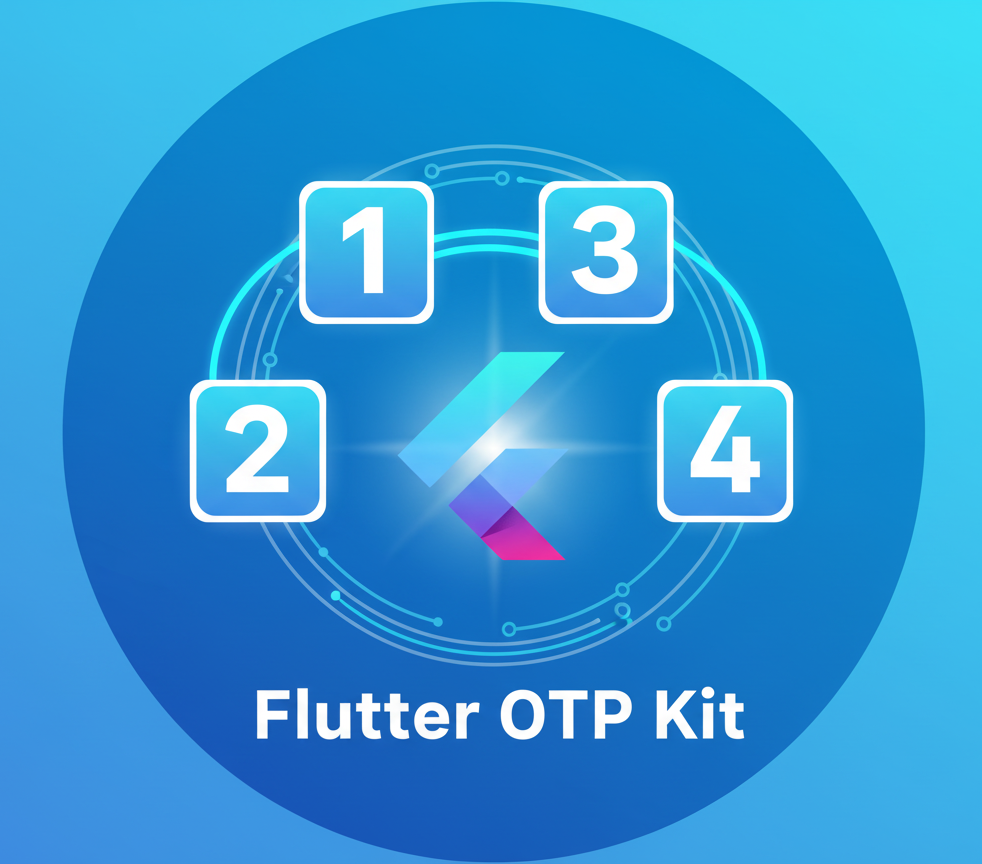

# Flutter OTP Kit

<div align="center">
  
  
  **🚀 The Ultimate OTP Verification Solution for Flutter**
  
  [](https://pub.dev/packages/flutter_otp_kit)
  [](https://github.com/seifmoustafa/flutter_otp_kit/blob/main/LICENSE)
  [](https://flutter.dev)
  [](https://github.com/seifmoustafa/flutter_otp_kit)
</div>

---

## 🎯 Why Choose Flutter OTP Kit?

The most **comprehensive**, **feature-rich**, and **performant** OTP verification solution for Flutter. Built with modern architecture, enterprise-grade security, and unlimited customization options.

### ✨ Key Features

- 🚀 **Complete Solution** - Timer, validation, masking, SMS autofill, biometric integration
- 🎨 **Unlimited Customization** - 16+ cursor styles, 7+ field shapes, 10+ animation types
- 🔒 **Enterprise Security** - Rate limiting, biometric integration, audit logging
- ⚡ **Performance First** - Lazy loading, memory optimization, animation pooling
- 📱 **Platform Optimized** - iOS, Android, Web, Desktop support
- ♿ **Accessibility Ready** - Screen reader support, keyboard navigation, voice control

---

## 📱 Demo

| Basic Theme | Animated Fields | Custom Styles |
|-------------|-----------------|---------------|
|  |  |  |

---

## 🚀 Quick Start

### Installation

Add this to your `pubspec.yaml`:

```yaml
dependencies:
  flutter_otp_kit: ^3.0.1
```

Then run:

```bash
flutter pub get
```

### Basic Usage

```dart
import 'package:flutter_otp_kit/flutter_otp_kit.dart';

class OtpScreen extends StatelessWidget {
  @override
  Widget build(BuildContext context) {
    return Scaffold(
      body: OtpKit(
        title: 'Verify Phone Number',
        subtitle: 'Enter the code sent to +1 (555) 123-4567',
        fieldCount: 4,
        onVerify: (otp) async {
          // Verify OTP with your backend
          return await verifyOtpWithBackend(otp);
        },
        onResend: () {
          // Resend OTP logic
          resendOtp();
        },
      ),
    );
  }
}
```

---

## 🎨 Customization Examples

### Modern Design with Animations

```dart
OtpKit(
  title: 'Verify Email',
  subtitle: 'Enter the verification code',
  fieldCount: 6,
  
  // Modern field styling
  fieldConfig: OtpFieldConfig.preset(OtpFieldPreset.modern),
  
  // Smooth animations
  animationConfig: OtpAnimationConfig(
    enableAnimation: true,
    fieldFillAnimationType: FieldFillAnimationType.rotate,
    errorFieldAnimationType: ErrorFieldAnimationType.bounce,
  ),
  
  // Colors and theming
  primaryColor: Colors.purple,
  successColor: Colors.green,
  errorColor: Colors.red,
  
  onVerify: (otp) async => await verifyOtp(otp),
  onResend: () => resendOtp(),
)
```

### Rounded Fields with Custom Styling

```dart
OtpKit(
  title: 'Security Code',
  fieldCount: 4,
  
  // Custom field configuration
  fieldConfig: OtpFieldConfig(
    fieldWidth: 60,
    fieldHeight: 60,
    borderRadius: 30, // Circular fields
    borderWidth: 2,
    fieldShape: OtpFieldShape.circle,
    
    // Shadow effects
    enableShadow: true,
    shadowColor: Colors.blue.withOpacity(0.3),
    shadowBlurRadius: 8,
    
    // Typography
    fieldFontSize: 24,
    fieldFontWeight: FontWeight.bold,
  ),
  
  onVerify: (otp) async => await verifyOtp(otp),
  onResend: () => resendOtp(),
)
```

### Underlined Style (Minimal Design)

```dart
OtpKit(
  title: 'Enter Code',
  fieldCount: 4,
  
  // Underlined field preset
  fieldConfig: OtpFieldConfig.preset(OtpFieldPreset.underlined),
  
  // Slide animation
  animationConfig: OtpAnimationConfig(
    enableAnimation: true,
    fieldFillAnimationType: FieldFillAnimationType.slide,
  ),
  
  // Minimal colors
  primaryColor: Colors.black,
  backgroundColor: Colors.transparent,
  
  onVerify: (otp) async => await verifyOtp(otp),
  onResend: () => resendOtp(),
)
```

---

## 🔧 Advanced Configuration

### Enterprise Features

```dart
OtpKit(
  title: 'Secure Verification',
  fieldCount: 6,
  
  // SMS Autofill
  smsConfig: OtpSmsConfig(
    enableSmsAutofill: true,
    enableSmartAuth: true,
    enableSmsRetrieverAPI: true, // Android
    enableSmsUserConsentAPI: true, // Android
  ),
  
  // Security features
  securityConfig: OtpSecurityConfig(
    enableRateLimiting: true,
    maxAttemptsPerMinute: 3,
    maxAttemptsPerHour: 15,
    lockoutDuration: Duration(minutes: 10),
    enableBiometricIntegration: true,
    enableAuditLogging: true,
  ),
  
  // Performance optimization
  performanceConfig: OtpPerformanceConfig(
    enableLazyLoading: true,
    enableMemoryOptimization: true,
    enableAnimationPooling: true,
    enablePerformanceMonitoring: true,
  ),
  
  // Error handling
  errorConfig: OtpErrorConfig(
    maxErrorRetries: 3,
    enableFieldLockout: true,
    clearFieldsOnError: true,
    enableHapticFeedbackOnError: true,
  ),
  
  onVerify: (otp) async => await verifyOtp(otp),
  onResend: () => resendOtp(),
)
```

### Custom Cursor Styles

```dart
// Different cursor styles available
OtpKit(
  fieldConfig: OtpFieldConfig(
    cursorStyle: CursorStyle.bar,        // Vertical bar
    // cursorStyle: CursorStyle.block,      // Filled block
    // cursorStyle: CursorStyle.underline,  // Underline
    // cursorStyle: CursorStyle.outline,    // Rectangle outline
    // cursorStyle: CursorStyle.doubleBar,  // Two bars
    // cursorStyle: CursorStyle.none,       // No cursor
    
    cursorColor: Colors.blue,
    cursorWidth: 2.0,
  ),
  
  // Cursor animation
  animationConfig: OtpAnimationConfig(
    enableCursorAnimation: true,
    cursorBlinkDuration: Duration(milliseconds: 800),
  ),
  
  onVerify: (otp) async => await verifyOtp(otp),
  onResend: () => resendOtp(),
)
```

---

## 📋 Field Shapes & Presets

### Available Field Shapes

```dart
enum OtpFieldShape {
  rectangle,        // Square corners
  roundedRectangle, // Rounded corners
  circle,          // Circular shape
  stadium,         // Pill shape (completely rounded)
  underlined,      // Bottom border only
  outlined,        // Material design outlined
  custom,          // Custom shape
}
```

### Quick Presets

```dart
// Use predefined presets for quick setup
OtpFieldConfig.preset(OtpFieldPreset.basic)      // Simple rectangle
OtpFieldConfig.preset(OtpFieldPreset.modern)     // Modern rounded
OtpFieldConfig.preset(OtpFieldPreset.rounded)    // Circular fields
OtpFieldConfig.preset(OtpFieldPreset.underlined) // Minimal underlined
```

---

## 🎬 Animation Types

### Field Fill Animations

```dart
enum FieldFillAnimationType {
  none,        // No animation
  scale,       // Scale up when filled
  rotate,      // Rotate when filled
  slideLeft,   // Slide from left
  slideRight,  // Slide from right
  slideUp,     // Slide from top
  slideDown,   // Slide from bottom
  autoSlide,   // Auto-detect direction based on text direction
}
```

### Error Animations

```dart
enum ErrorFieldAnimationType {
  none,     // No error animation
  shake,    // Horizontal shake
  bounce,   // Bounce effect
  pulse,    // Pulse/scale effect
  wiggle,   // Wiggle animation
}
```

### Animation Configuration Example

```dart
OtpAnimationConfig(
  // Enable animations
  enableAnimation: true,
  enableFieldStateAnimation: true,
  enableCursorAnimation: true,
  
  // Animation timing
  animationDuration: Duration(milliseconds: 300),
  animationCurve: Curves.easeOutCubic,
  
  // Field fill animation
  fieldFillAnimationType: FieldFillAnimationType.scale,
  fieldFillScaleFactor: 1.1,
  
  // Error animation
  errorFieldAnimationType: ErrorFieldAnimationType.shake,
  errorShakeAmplitude: 8.0,
  errorShakeFrequency: 15.0,
  
  // Cursor animation
  cursorBlinkDuration: Duration(milliseconds: 800),
)
```

---

## 🔒 Security Features

### Rate Limiting

```dart
OtpSecurityConfig(
  enableRateLimiting: true,
  maxAttemptsPerMinute: 3,
  maxAttemptsPerHour: 15,
  lockoutDuration: Duration(minutes: 10),
)
```

### Biometric Integration

```dart
OtpSecurityConfig(
  enableBiometricIntegration: true,
  biometricTimeout: Duration(seconds: 30),
)

// Check biometric availability
final isAvailable = await OtpBiometricService.instance.isBiometricAvailable();
if (isAvailable) {
  final authenticated = await OtpBiometricService.instance.authenticate();
}
```

### Advanced Validation

```dart
OtpSecurityConfig(
  enableAdvancedValidation: true,
  validationPattern: r'^\d{6}$', // 6-digit numbers only
  enableEncryption: true,
  enableAuditLogging: true,
)
```

---

## 📱 SMS Autofill

### iOS Native SMS

```dart
OtpSmsConfig(
  enableSmsAutofill: true,
  // iOS automatically detects SMS codes
)
```

### Android SMS Retriever API

```dart
OtpSmsConfig(
  enableSmsRetrieverAPI: true,
  appSignature: 'YOUR_APP_SIGNATURE', // Required for SMS Retriever
)
```

### Android User Consent API

```dart
OtpSmsConfig(
  enableSmsUserConsentAPI: true,
  senderPhoneNumber: '+1234567890', // Optional: filter by sender
)
```

### Smart Auth Integration

```dart
OtpSmsConfig(
  enableSmartAuth: true,
  enableSmsValidation: true,
  smsValidationRegex: r'\b\d{6}\b', // Extract 6-digit codes
  smsTimeout: Duration(minutes: 5),
)
```

---

## ⚡ Performance Optimization

### Memory Management

```dart
OtpPerformanceConfig(
  enableMemoryOptimization: true,
  enableMemoryLeakDetection: true,
  enableBackgroundCleanup: true,
  cleanupInterval: Duration(minutes: 2),
)
```

### Animation Optimization

```dart
OtpPerformanceConfig(
  enableAnimationOptimization: true,
  enableAnimationPooling: true,
  maxAnimationPoolSize: 12,
  animationCleanupDelay: Duration(seconds: 3),
)
```

### Lazy Loading

```dart
OtpPerformanceConfig(
  enableLazyLoading: true,
  maxVisibleFields: 8, // Only render visible fields
  enableFieldRecycling: true,
)
```

---

## 🎯 Error Handling

### Error Configuration

```dart
OtpErrorConfig(
  // Retry logic
  maxErrorRetries: 3,
  enableFieldLockout: true,
  fieldLockoutDuration: Duration(seconds: 30),
  
  // Error display
  errorTextMaxLines: 2,
  showErrorIcon: true,
  errorIcon: Icons.error_outline,
  
  // Error behavior
  clearFieldsOnError: true,
  autoClearErrorOnInput: true,
  
  // Haptic feedback
  enableHapticFeedbackOnError: true,
  errorHapticFeedbackType: ErrorHapticFeedbackType.heavy,
  
  // Error animations
  errorShakeEffect: true,
  errorShakeDuration: Duration(milliseconds: 500),
  errorShakeCount: 3,
)
```

### Error Handling Example

```dart
OtpKit(
  onVerify: (otp) async {
    try {
      final isValid = await verifyOtpWithBackend(otp);
      if (isValid) {
        // Success - navigate to next screen
        Navigator.pushReplacement(context, MaterialPageRoute(
          builder: (context) => HomeScreen(),
        ));
        return true;
      } else {
        // Invalid OTP
        ScaffoldMessenger.of(context).showSnackBar(
          SnackBar(content: Text('Invalid OTP. Please try again.')),
        );
        return false;
      }
    } catch (e) {
      // Network or other error
      ScaffoldMessenger.of(context).showSnackBar(
        SnackBar(content: Text('Error verifying OTP: $e')),
      );
      return false;
    }
  },
  
  // Error state change callback
  onErrorStateChanged: (hasError) {
    if (hasError) {
      print('OTP verification failed');
    }
  },
)
```

---

## 🌍 Internationalization & Accessibility

### RTL Support

```dart
OtpKit(
  // Automatic RTL detection
  textDirection: TextDirection.rtl, // or TextDirection.ltr
  
  // RTL-aware animations
  animationConfig: OtpAnimationConfig(
    fieldFillAnimationType: FieldFillAnimationType.autoSlide,
  ),
)
```

### Accessibility

```dart
OtpKit(
  // Screen reader support
  enableScreenReaderSupport: true,
  
  // Semantic labels
  title: 'Verify Phone Number',
  subtitle: 'Enter the 4-digit code sent to your phone',
  
  // Keyboard navigation
  enableInteractiveSelection: true,
  unfocusOnTapOutside: true,
)
```

### Custom Text Styling

```dart
OtpKit(
  // Title styling
  titleStyle: TextStyle(
    fontSize: 24,
    fontWeight: FontWeight.bold,
    color: Colors.black,
  ),
  
  // Subtitle styling
  subtitleStyle: TextStyle(
    fontSize: 16,
    color: Colors.grey[600],
  ),
  
  // Button styling
  buttonStyle: TextStyle(
    fontSize: 18,
    fontWeight: FontWeight.w600,
  ),
)
```

---

## 📊 Callbacks & Events

### Available Callbacks

```dart
OtpKit(
  // Required callbacks
  onVerify: (String otp) async {
    // Return true for success, false for failure
    return await verifyOtp(otp);
  },
  onResend: () {
    // Resend OTP logic
    resendOtp();
  },
  
  // Optional callbacks
  onChanged: (String otp) {
    print('Current OTP: $otp');
  },
  
  onCompleted: (String otp) {
    print('OTP completed: $otp');
    // Auto-verify when completed
  },
  
  onTimerChanged: (int remainingSeconds) {
    print('Timer: $remainingSeconds seconds remaining');
  },
  
  onErrorStateChanged: (bool hasError) {
    print('Error state: $hasError');
  },
  
  onValidationStateChanged: (bool isValid) {
    print('Validation state: $isValid');
  },
  
  onCompletionStateChanged: (bool isCompleted) {
    print('Completion state: $isCompleted');
  },
)
```

---

## 🛠️ Platform-Specific Features

### iOS Features

- **Face ID Integration** - Seamless biometric authentication
- **Touch ID Support** - Fingerprint authentication
- **Native SMS Autofill** - Automatic SMS code detection
- **VoiceOver Support** - Full accessibility support

### Android Features

- **Fingerprint Authentication** - Biometric security
- **Face Recognition** - Advanced biometric options
- **SMS Retriever API** - Automatic SMS reading
- **SMS User Consent API** - User-controlled SMS access
- **TalkBack Support** - Accessibility features

### Web Features

- **Keyboard Navigation** - Full keyboard support
- **Screen Reader Support** - Web accessibility
- **Responsive Design** - Adaptive layouts
- **Performance Optimization** - Web-specific optimizations

### Desktop Features

- **Platform Layouts** - Native desktop feel
- **Keyboard Navigation** - Desktop-optimized controls
- **Accessibility** - Desktop accessibility features
- **Performance** - Desktop-specific optimizations

---

## 📈 Performance Monitoring

### Real-time Monitoring

```dart
// Enable performance monitoring
OtpPerformanceConfig(
  enablePerformanceMonitoring: true,
)

// Access performance metrics
final monitor = OtpPerformanceMonitor.instance;
final metrics = await monitor.getPerformanceMetrics();

print('Memory usage: ${metrics.memoryUsage}MB');
print('Animation FPS: ${metrics.animationFps}');
print('Field render time: ${metrics.fieldRenderTime}ms');
```

### Memory Optimization

```dart
// Automatic memory cleanup
OtpPerformanceConfig(
  enableMemoryOptimization: true,
  enableMemoryLeakDetection: true,
  enableBackgroundCleanup: true,
)

// Manual cleanup
OtpPerformanceMonitor.instance.cleanup();
```

---

## 🔄 Migration Guide

### From Previous Versions

#### Old Way (still works but deprecated):
```dart
OtpVerificationWidget(
  onVerify: (otp) => backend.verify(otp),
  onResend: () => backend.resend(),
)
```

#### New Way (recommended):
```dart
OtpKit(
  onVerify: (otp) async => await backend.verify(otp),
  onResend: () => backend.resend(),
)
```

### Breaking Changes in 3.0.0

- **Animations disabled by default** - Explicitly enable with `enableAnimation: true`
- **New OtpKit widget** - Replaces OtpVerificationWidget (still backward compatible)
- **Performance-first approach** - Zero overhead unless features are enabled

---

## 🚨 Troubleshooting

### Common Issues

#### SMS Autofill Not Working

**Android:**
```dart
// Ensure app signature is correct
OtpSmsConfig(
  enableSmsRetrieverAPI: true,
  appSignature: 'YOUR_CORRECT_APP_SIGNATURE',
)

// Check permissions in AndroidManifest.xml
<uses-permission android:name="android.permission.RECEIVE_SMS" />
<uses-permission android:name="com.google.android.gms.auth.api.phone.permission.SEND" />
```

**iOS:**
```dart
// Ensure SMS format is correct
// SMS should contain app-associated domain
```

#### Performance Issues

```dart
// Disable animations for better performance
OtpAnimationConfig(
  enableAnimation: false,
)

// Enable performance optimizations
OtpPerformanceConfig(
  enableMemoryOptimization: true,
  enableAnimationOptimization: true,
)
```

#### Biometric Issues

```dart
// Check biometric availability first
final isAvailable = await OtpBiometricService.instance.isBiometricAvailable();
if (!isAvailable) {
  // Handle no biometric support
  showDialog(
    context: context,
    builder: (context) => AlertDialog(
      title: Text('Biometric Not Available'),
      content: Text('Please set up biometric authentication in device settings.'),
    ),
  );
}
```

---

## 📚 API Reference

### OtpKit Parameters

| Parameter | Type | Required | Default | Description |
|-----------|------|----------|---------|-------------|
| `onVerify` | `Future<bool> Function(String)` | ✅ | - | Verify OTP callback |
| `onResend` | `VoidCallback` | ✅ | - | Resend OTP callback |
| `fieldCount` | `int` | ❌ | `4` | Number of OTP fields |
| `fieldConfig` | `OtpFieldConfig?` | ❌ | `null` | Field styling configuration |
| `animationConfig` | `OtpAnimationConfig?` | ❌ | `null` | Animation settings |
| `smsConfig` | `OtpSmsConfig?` | ❌ | `null` | SMS autofill configuration |
| `securityConfig` | `OtpSecurityConfig?` | ❌ | `null` | Security features |
| `performanceConfig` | `OtpPerformanceConfig?` | ❌ | `null` | Performance optimization |
| `errorConfig` | `OtpErrorConfig?` | ❌ | `null` | Error handling |
| `title` | `String?` | ❌ | `null` | Main title text |
| `subtitle` | `String?` | ❌ | `null` | Subtitle text |
| `primaryColor` | `Color?` | ❌ | `Colors.blue` | Primary theme color |
| `successColor` | `Color?` | ❌ | `Colors.green` | Success state color |
| `errorColor` | `Color?` | ❌ | `Colors.red` | Error state color |

---

## 🤝 Contributing

We welcome contributions! Please see our [Contributing Guide](CONTRIBUTING.md) for details.

### Development Setup

```bash
# Clone the repository
git clone https://github.com/seifmoustafa/flutter_otp_kit.git

# Install dependencies
cd flutter_otp_kit
flutter pub get

# Run example
cd example
flutter run
```

### Running Tests

```bash
flutter test
```

---

## 📄 License

This project is licensed under the MIT License - see the [LICENSE](LICENSE) file for details.

---

## 🙏 Support

If you find this package helpful, please:

- ⭐ **Star the repository** on GitHub
- 👍 **Like the package** on pub.dev
- 🐛 **Report issues** on GitHub
- 💡 **Suggest features** via GitHub discussions
- ☕ **Buy me a coffee** if you'd like to support development

[](https://buymeacoffee.com/seifmoustafa)

---

## 📞 Contact

- **GitHub**: [@seifmoustafa](https://github.com/seifmoustafa)
- **LinkedIn**: [Seif Moustafa](https://www.linkedin.com/in/seif-moustafa-60115f/)
- **Email**: [Contact via GitHub](https://github.com/seifmoustafa)

---

<div align="center">
  <h3>Made with ❤️ for the Flutter Community</h3>
  <p>Flutter OTP Kit - The most comprehensive OTP verification solution</p>
</div>
